# Intern Management System

## Project Overview

The **Intern Management System** is a web-based application developed using **Laravel** and **MySQL** to simplify and automate the internship management process. It provides a centralized platform where interns can manage their daily activities, while mentors can monitor progress, evaluate performance, and identify top-performing interns.

---

## Purpose

The purpose of this project is to digitize the internship workflow within an organization by providing an efficient system for attendance management, task submission, progress tracking, performance evaluation, and certificate generation.

---

## Features

- Secure authentication for interns and mentors
- Daily attendance management
- Daily task submission
- Weekly task tracking
- Weekly report submission
- Progress tracking dashboard
- Mentor dashboard for monitoring intern activities
- Performance evaluation
- Top intern ranking
- Automatic internship certificate generation
- User-friendly and responsive interface

---

## System Workflow

1. Intern logs into the system.
2. Marks daily attendance.
3. Completes and submits daily tasks.
4. Submits the weekly report.
5. The next week's tasks become available only after completing the current week's tasks.
6. Mentors review intern performance and submitted work.
7. The system displays top-performing interns.
8. After successful completion of the internship, the system generates a certificate automatically.

---

## Technologies Used

- Laravel
- PHP
- MySQL
- Ajax
- Blade Template Engine
- HTML5
- CSS3
- Bootstrap+ Tailwind
- JavaScript

---

## Screenshots
## Screenshots

### Dashboard
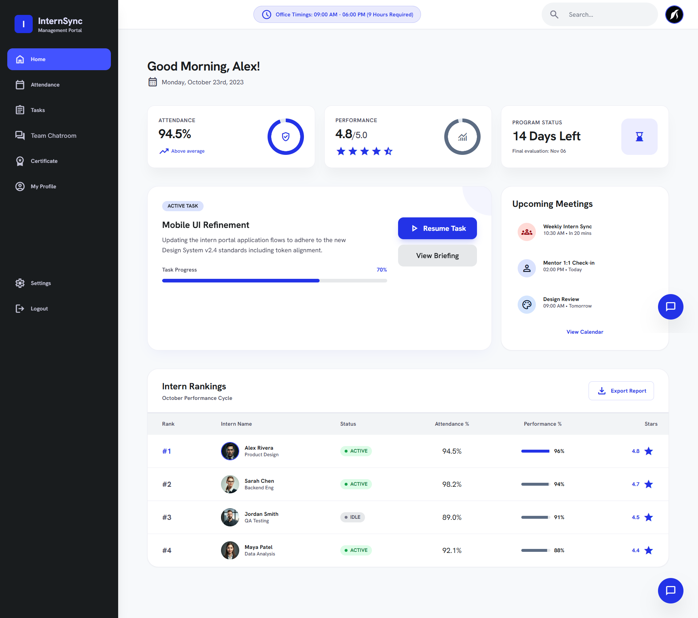

### Login Page (Light Mode)


### Login Page (Dark Mode)


### Mentor Dashboard
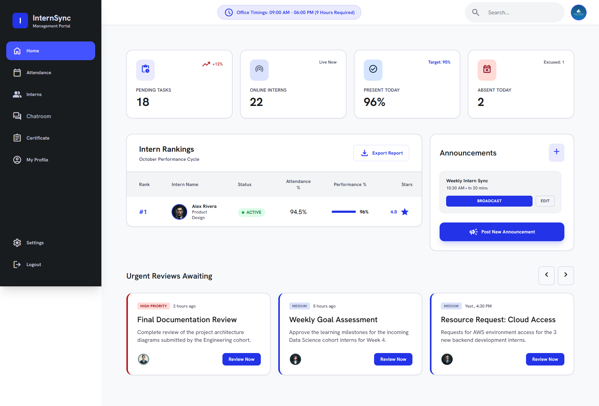

### All Interns
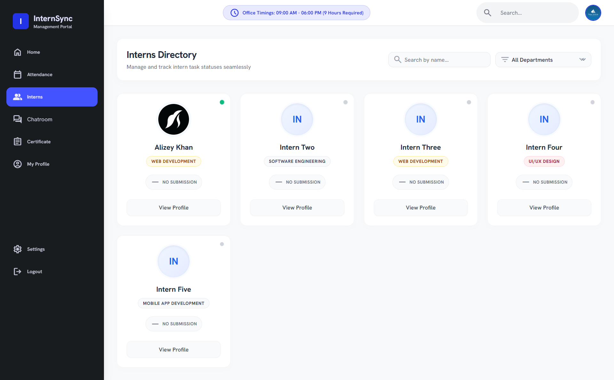

### Attendance
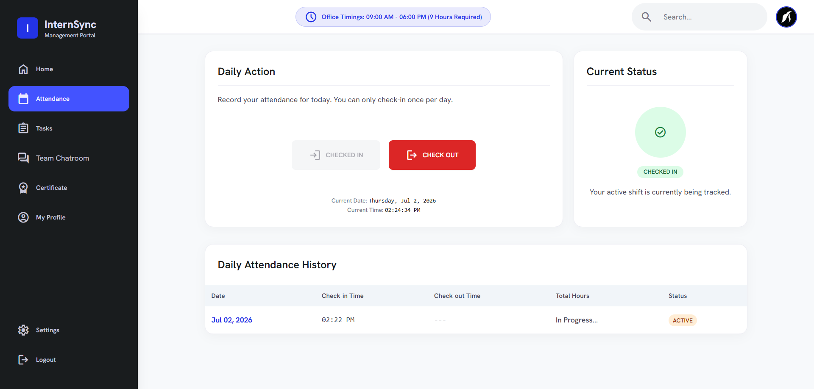

### Check Attendance
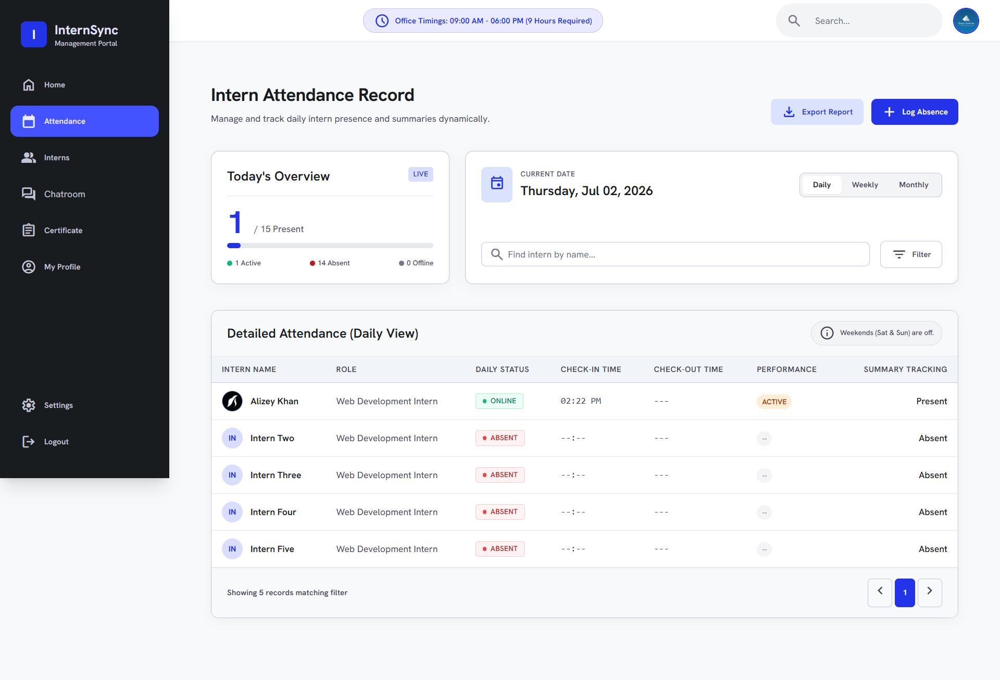

### Daily Tasks
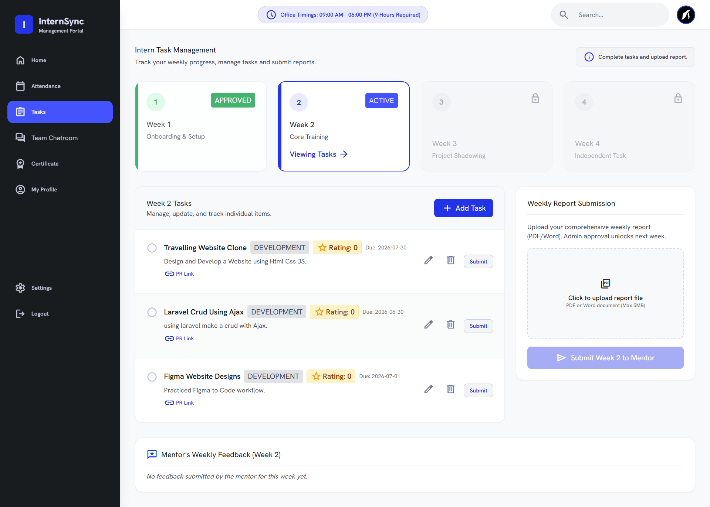

### Chat Room
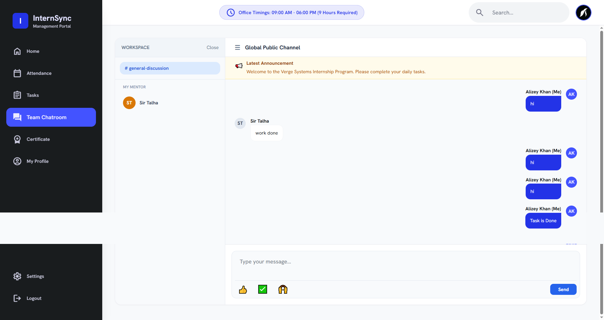

### Intern Profile
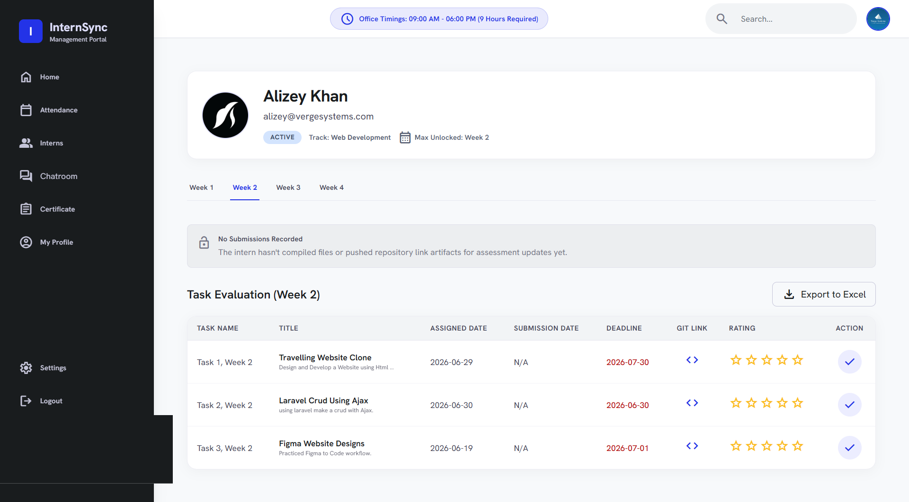

### Edit Profile


### Profile
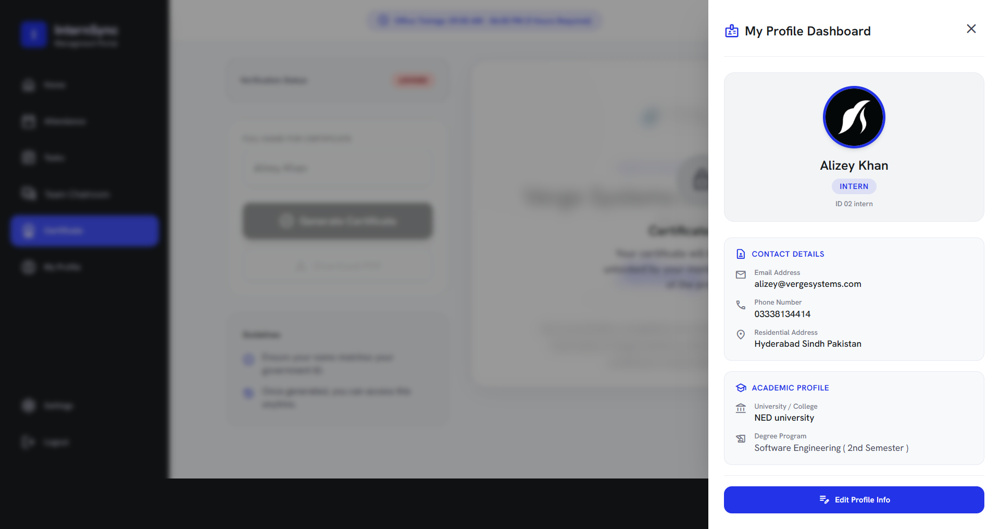

### Certificate
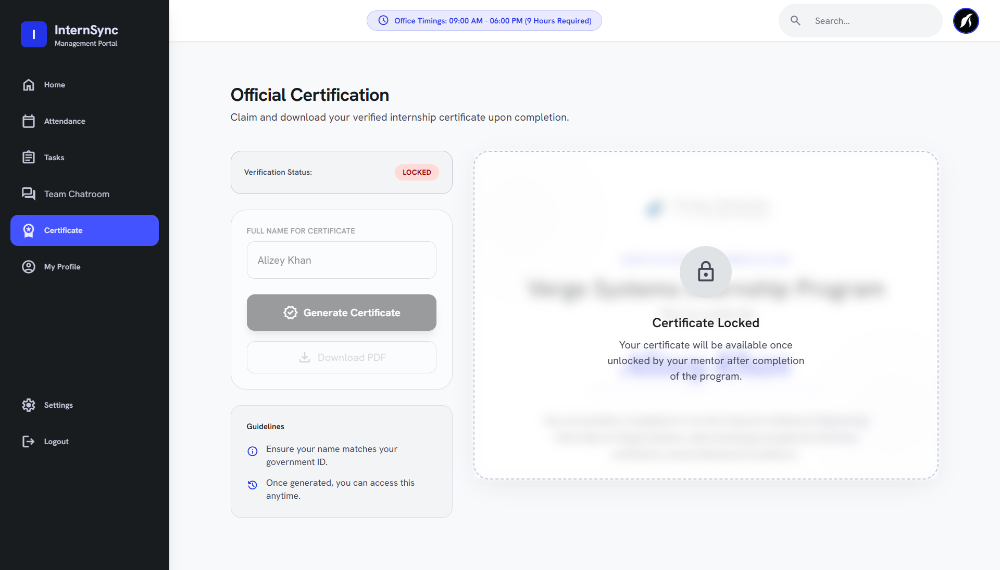

### Certificate Unlock
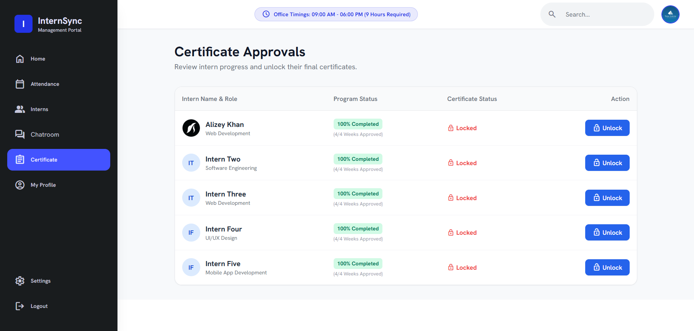
## Installation

1. Clone the repository

```bash
git clone https://github.com/yourusername/intern-management-system.git
```

2. Navigate to the project folder

```bash
cd intern-management-system
```

3. Install dependencies

```bash
composer install
```

4. Copy the environment file

```bash
cp .env.example .env
```

5. Generate the application key

```bash
php artisan key:generate
```

6. Configure your database in the `.env` file.

7. Run migrations

```bash
php artisan migrate
```

8. Start the development server

```bash
php artisan serve
```

---

## Future Enhancements

- Email notifications
- Interview scheduling
- Leave management
- Admin analytics dashboard
- Mobile application support

---

## Author

**Alizey Khan**

Laravel Web Developer

---

## License

This project is developed for educational and internship purposes.
